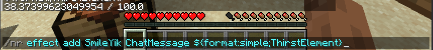
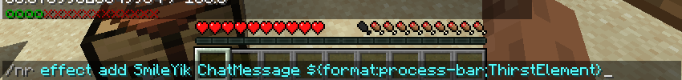

> 最后更新于2024年07月27日 | [历史记录](https://github.com/SmileYik/NumericalRequirements/commits/master/docs/ElementFormatter.md)

`ElementFormatter` 是一个元素格式化器，用来将当前的元素值以文本的方式显示出来。
有些元素格式化器可能要进行相关的配置后才能体现出令人满意的效果。

### 元素格式化占位符

元素格式化占位符可以放置在允许使用的消息文本中发送给玩家，插件会将消息文本中的元素格式化占位符替换为相应文本。

目前支持元素格式化占位符的 `Effect` 效果有 `ChatMessage`、`ActionBar` 和 `TitleMessage`。

元素格式化占位符格式如下所示：

```
${format:[元素格式化器ID];[元素ID]}
```

例如 `${format:process-bar;ThirstElement}` 则代表使用 `process-bar` 格式化 `ThirstElement`。

如果某元素不适合指定的元素格式化器，则会显示一个不支持字样。

### 目前拥有的元素格式化器

#### PercentageFormatter - 百分数格式化器

`PercentageFormatter` 是用于将玩家的元素值格式化为相对于元素值上界之间的比例，并且保留两位小数。
例如某一个元素值的上界为 100，一名玩家当前的该元素值为 26.5, 那么格式化出来的值为 26.50%。

该格式化器在插件中注册的ID为: `percent`, 格式化占位符使用范例(显示口渴值)： `${format:percent;ThirstElement}`


#### SimpleElementFormatter - 简单的数值格式化器

`SimpleElementFormatter` 是将元素值的具体值和上界值一起显示出来，显示格式大致为 `当前值 / 元素上界值`。

该格式化器在插件中注册的ID为: `simple`, 格式化占位符使用范例(显示口渴值)： `${format:simple;ThirstElement}`



#### ProcessBarFormatter - 进度条格式化器

`ProcessBarFormatter` 可以将元素的值以进度条的方式显示出来。此外，该格式化器能够进行配置以改变进度条样式。

该格式化器在插件中注册的ID为: `process-bar`, 格式化占位符使用范例(显示口渴值)： `${format:process-bar;ThirstElement}`



##### ProcessBarFormatter 的配置片段

`ProcessBarFormatter` 可以在插件的 `config.yml` 文件中进行配置，其配置路径在 `formatter.process-bar` 下。

```yaml
# 填满进度条时的字符
fill: '&2o'
# 进度条为空时的字符
empty: "&4x"
# 进度条长度
length: 16
```
