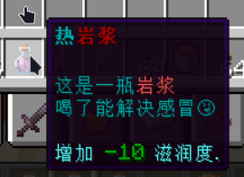

> 最后更新于2024年07月28日 | [历史记录](https://github.com/SmileYik/NumericalRequirements/commits/master/docs/Thirst.md)

`Thirst` 是口渴值拓展, 增加了口渴值元素, 并允许玩家使用玻璃瓶获取液体.
该拓展的配置文件在 `/plugins/NumericalRequirements/thirst/config.yml` 中.

### ThirstElement: 口渴值元素

口渴值元素是一个会随着时间自动流失的元素. 其主要的配置片段在 `thirst` 下. 
在该配置片段下可以设置元素的最大值, 每秒消减的数值以及死亡惩罚等.
`thirst.effect-bundles` 下设置的效果包将会加入全局效果包中.
`thirst.effect-handler` 配置元素处理器, 而 `thirst.effects` 为元素处理器的配置片段.
对于元素处理器的选择和配置说明请进入其说明页面查看.

#### 默认的配置

```yaml
thirst:
  # 元素数值上界
  max-value: 100
  # 自然流失速度，多少值每秒
  natural-depletion: 0.25
  death-punishment: # 死亡惩罚
    enable: true    # 开关
    value: 60       # 复活时口渴值为上限的百分之几。取值范围为0～100
    effect:         # 复活时赋予的效果
      first:        # 可列多个
        bundle: "口渴值死亡惩罚" # 效果包的ID
        duration: 60  # 持续时间 秒
      '2':
        bundle: "缺水"
        duration: 60
  # 效果包设置
  effect-bundles:
    "口渴值死亡惩罚":
      type: "元素负面效果"
      PotionEffect:
        effect-1:
          potion-type: "SLOW"
          amplifier: 0
    "缺水":
      type: "元素负面效果"
      PotionEffect:
        effect-1:
          potion-type: "SLOW"
          amplifier: 0
    "滋润":
      type: "元素增益效果"
      PotionEffect:
        effect-1:
          potion-type: "SPEED"
          amplifier: 0
  ##########################
  #    口渴要素数值管理器
  ##########################

  # 目前只有这一个，具体行为为，在元素值进入所设置的范围时赋予玩家效果包效果
  effect-handler: org.eu.smileyik.numericalrequirements.core.api.element.handler.RangeHandler
  # 数值管理器参数
  effects:
    # 占位符，这个不重要，你想处理多少范围就加多少个
    "level-1":
      # 范围：数值到该范围内触发
      range: [0, 10]
      # 范围是否为百分数，
      # 若为百分数则实际范围为所设定范围的: range * 数值上界 / 100
      # 否则则为字面值
      percentage: true
      # 所需要附加的效果包ID
      bundle: "缺水"
      # 效果包持续时间, 单位为秒
      duration: 20
      # 第一次值进入该范围时所使用的消息效果ID
      # 支持的效果ID有：ChatMessage; ActionBar; TitleMessage
      message-sender: "ChatMessage"
      # 传递给消息效果的参数，为列表，不同效果所要求的参数不同
      # ChatMessage, ActionBar: 直接设置一行即可，该行就为发送给玩家的消息
      # TitleMessage: 参数需要5行，第一行为主标题、第二行为副标题、第三行为淡入时间（游戏刻）、第四行为持续时间（游戏刻）、第五行为淡出时间（游戏刻）
      # 所有消息效果中的消息文本都支持元素格式化显示占位符
      # 元素格式化占位符格式为：${format:<格式化程序ID>;<要素ID>}
      message:
        - "你嗓子都要冒烟了"
    "level-2":
      range: [90, 100]
      percentage: true
      bundle: "滋润"
      duration: 20
      message-sender: "ActionBar"
      message:
        - "你听，肚子里开始晃荡晃荡响了也"
```

### 注册的物品标签

#### Lore 标签: Thirst

`Thirst` 标签是一个可以融合的Lore标签, 并且其也是一个可消耗品类型标签; 它拥有一个保留1位小数位的小数作为参数.
拥有该标签的物品会被玩家右键使用而消耗, 消耗过程中会根据标签的设定的参数来修改使用玩家的口渴元素值.

该标签可以使用指令 `/nr item add Thirst [数值]` 来为手上的物品进行添加. 在默认配置下的显示效果如图.



##### Thirst 标签的配置

`Thirst` 标签是可配置的, 它的配置项在 `/plugins/NumericalRequirements/thirst/config.yml` 中的 `tag.thirst` 下.
默认的配置为:

```yaml
# 标签设置
tag:
  # 口渴值的Lore标签设置 <%:numf1> 为保留一位小数位的浮点数占位符
  thirst: "§b增加 §2<%:numf1> §b滋润度."
```

其中的 `<%:numf1>` 为元素值的占位符, 将会被替换为指定的值.

#### NBT 物品标签: nerq-thirst

`nerq-thirst` 是一个 NBT 物品标签, 数值为浮点型, 其功能与 Lore 标签 `Thirst` 相同. 
物品在加入该标签时, 只会改变物品的NBT数据, 不会对 Lore 进行更改.

该标签可以使用指令 `/nr item add nerq-thirst [数值]` 来为手上的物品进行添加.

### 获取流体功能

允许玩家使用空玻璃瓶右击流体方块获取自定义物品. 在默认配置中, 该功能被配置成: 用玻璃瓶右击水,
如果玩家与被右击的水距离为2格, 则阻止玩家获取原版的水瓶, 给予玩家自定义设定的水瓶.

该项功能的配置片段在 `/plugins/NumericalRequirements/thirst/config.yml` 中的 `get-liquid` 键下.
可以配置多个配置片段以启用获取不同流体的功能. `get-liquid` 配置片段下的格式类似于以下形式:

```yaml
get-liquid:
  配置片段1: {}
  配置片段2: {}
  配置片段n: {}
```

#### 获取流体功能的配置片段

```yaml
# 是否启用
enable: true
# 默认获取的流体物品ID
default-liquid: default-water
# 当右键哪些方块时则忽略取水
ignore:
  - "WATER_CAULDRON"
# 当右键哪些流体类型则算获取成功
liquid-type:
  - "STATIONARY_WATER"
  - "WATER"
  - "TALL_SEAGRASS"
  - "SEAGRASS"
# 获取流体时检测流体的最大距离
max-distance: 2
# 是否使用扫描模式检测所瞄准的流体
scan-mode: false
# 当玩家使用玻璃瓶右键空气时是否进行获取流体过程。
check-air: true
# 是否开启不同生物群系获取到不同类型的水
# 当生物群系的水未设置或者设置的物品ID对应的物品不存在则使用‘default-liquid’设置的物品
biome-liquid: true
# 生物群系设置，格式为
# 生物群系ID: 物品ID
biome:
  BEACH: sea-water
```

##### default-liquid

`default-liquid` 的值为一个物品ID, 代表默认情况下给予玩家的自定义物品.
在 `biome-liquid` 设定为 `true` 的情况下, 若某一个生物群系未被设定, 
则玩家在该生物群系中获取的物品则为 `default-liquid` 字段所设定的物品.

##### ignore

`ignore` 字段的值是一个文本列表, 文本为物品类型, 区分大小写. 当玩家手拿玻璃瓶右击方块时, 若右击到的方块类型为 
`ignore` 列表中包含的方块类型, 则会忽略玩家本次行动, 以原版逻辑为准.

物品类型的名称可以在 [Bukkit Javadoc](https://bukkit.windit.net/javadoc/org/bukkit/Material.html) 中找到.

例如, 在以下设置中能够实现, 如果玩家右键坩埚, 则允许玩家获取原版的水瓶的效果:
```yaml
ignore:
  - "WATER_CAULDRON"
```

##### liquid-type

`liquid-type` 字段的值也是一个文本列表, 文本为物品类型, 区分大小写. 代表着玩家右键哪些流体时会被接管.

物品类型的名称可以在 [Bukkit Javadoc](https://bukkit.windit.net/javadoc/org/bukkit/Material.html) 中找到.

以下是只接管被右击的物品为水的情况:
```yaml
liquid-type:
  - "STATIONARY_WATER"
  - "WATER"
  - "TALL_SEAGRASS"
  - "SEAGRASS"
```
在高版本中, 水中的植物可能会被影响判断, 故在高版本中可能需要添加海草等方块的名称进去才能在特殊情况下正常工作.

以下是只接管岩浆的情况:
```yaml
liquid-type:
  - "STATIONARY_LAVA"
  - "LAVA"
```

##### max-distance, scan-mode 和 check-air

`max-distance` 代表右击流体时, 判定为成功的距离(玩家与被右击的流体之间的距离), 该值是一个整数.
`scan-mode` 的值为布尔型, 代表右击流体时, 是否以扫描的方式检测流体. 
`check-air` 的值为布尔型, 代表玩家右击空气时, 是否继续检测流体. `true` 为继续检测, `false` 为放弃检测.

当 `scan-mode` 为 `true` 时, 玩家右键流体时, 会根据玩家所指方向, 从距离 1 ~ `max-distance` 依次遍历扫描方块, 直到获取到指定类型为止.
当 `scan-mode` 为 `false` 时, 玩家右键流体时, 会根据玩家所指方向, 直接获取 `max-distance` 距离的方块, 并判定其类型.

当玩家获取流体时, 距离大于 `max-distance`, 会阻止该行为的进行, 也就是说玩家不会获得到任何物品, 并且玻璃瓶还在自己手中.

##### biome-liquid 与 biome

`biome-liquid` 为布尔类型, 代表是否启用在不同生物群系下获取不同的物品.
`biome` 的值为 Map 型, 用于为对不同生物群系下设定获得的物品.

`biome` 的设置格式如下:

```yaml
biome:
  生物群系名1: 物品名1
  生物群系名2: 物品名2
  生物群系名n: 物品名3
```

生物群系名也可以在 [Bukkit Javadoc](https://bukkit.windit.net/javadoc/org/bukkit/block/Biome.html) 中寻找到, 也区分大小写.

下面是一个在海滩生物群系下获取海水的例子:
```yaml
biome-liquid: true
biome:
  BEACH: sea-water
```

#### 配置样例

这里介绍一些配置样例, 也许你可以在这找到配置灵感.

##### 样例1

在沙滩上获取盐水, 其他地方获取默认的水, 右键坩埚能获取原版水.

```yaml
get-liquid:
  water:
    enable: true
    default-liquid: default-water
    ignore:
      - "WATER_CAULDRON"
    liquid-type:
      - "STATIONARY_WATER"
      - "WATER"
      - "TALL_SEAGRASS"
      - "SEAGRASS"
    max-distance: 2
    scan-mode: false
    check-air: true
    biome-liquid: true
    biome: 
      BEACH: sea-water
```

##### 获取岩浆

多喝岩浆, 有益健康.

```yaml
get-liquid:
  lava:
    enable: true
    default-liquid: default-lava
    ignore: []
    liquid-type:
      - "STATIONARY_LAVA"
      - "LAVA"
    max-distance: 2
    scan-mode: false
    check-air: true
    biome-liquid: false
    biome: {}
```

##### 小孩子才做选择, 我全都要

[在沙滩上获取盐水, 其他地方获取默认的水, 右键坩埚能获取原版水](#样例1) 和 [获取岩浆](#获取岩浆) 我全都要!

```yaml
get-liquid:
  water:
    enable: true
    default-liquid: default-water
    ignore:
      - "WATER_CAULDRON"
    liquid-type:
      - "STATIONARY_WATER"
      - "WATER"
      - "TALL_SEAGRASS"
      - "SEAGRASS"
    max-distance: 2
    scan-mode: false
    check-air: true
    biome-liquid: true
    biome: 
      BEACH: sea-water
  lava:
    enable: true
    default-liquid: default-lava
    ignore: []
    liquid-type:
      - "STATIONARY_LAVA"
      - "LAVA"
    max-distance: 2
    scan-mode: false
    check-air: true
    biome-liquid: false
    biome: {}
```
